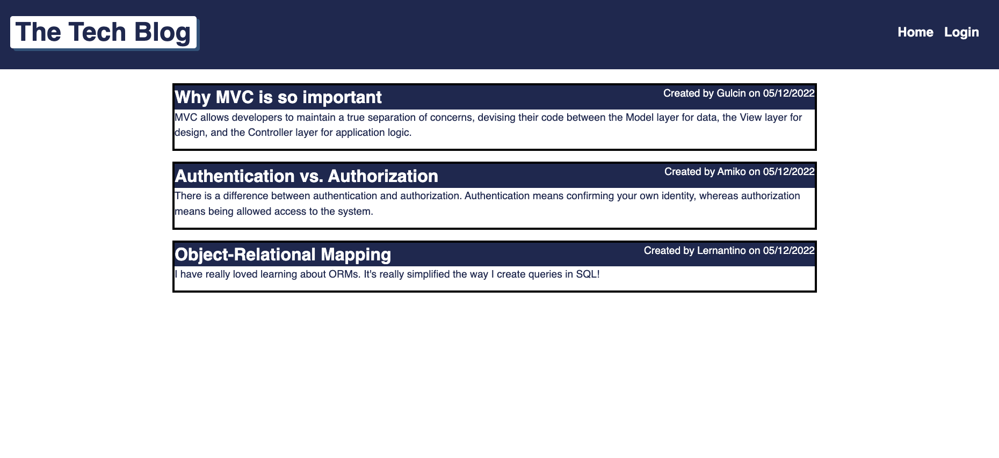
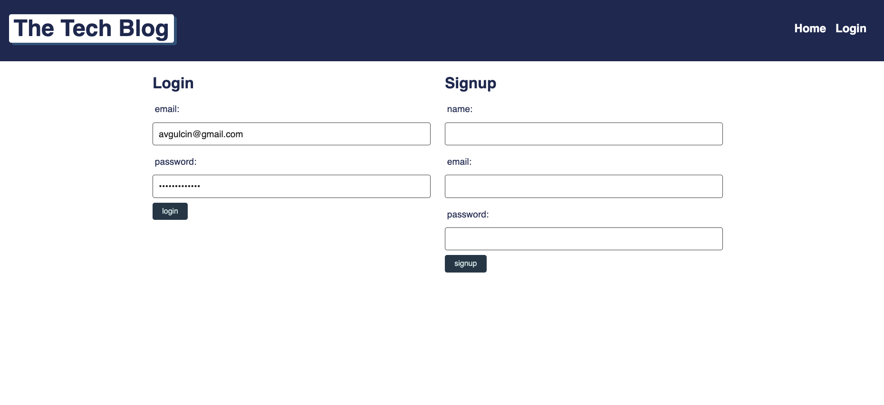
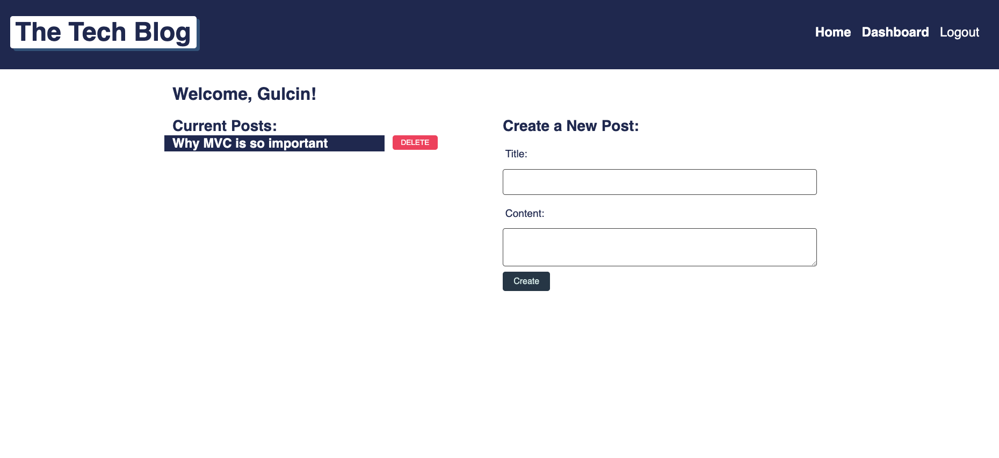
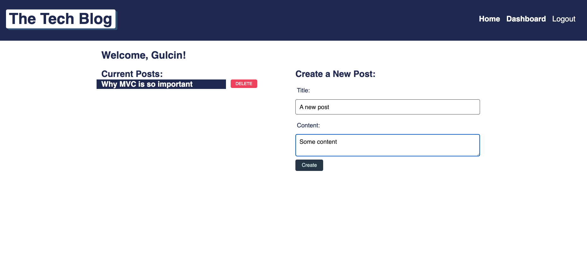
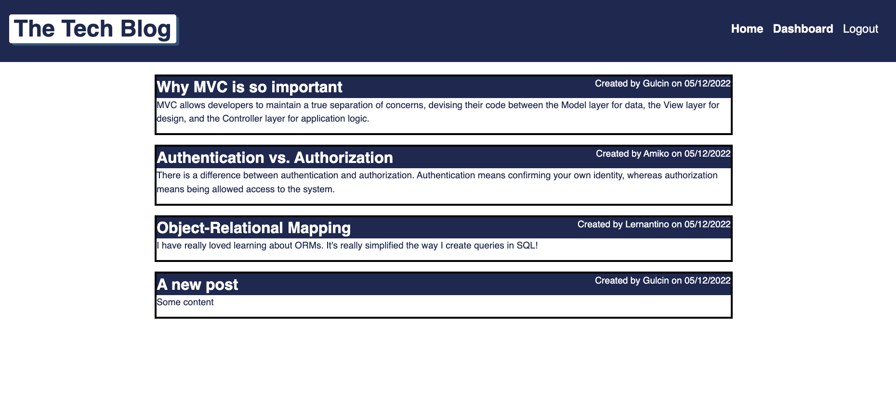
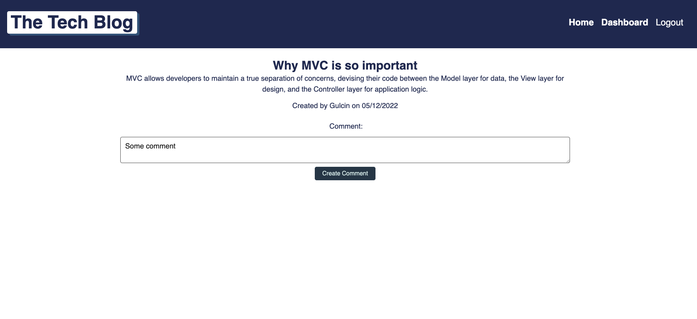

# The Tech Blog

## Description
Create a blog posts
## Installation
* npm run seed
* npm start

## Usage
Create a Team web site
## License
Apache
## Badges

## Contributing
Gulcin Dedeoglu

## Questions
* https://github.com/gulchintory
* avgulcin@gmail.com

# Github Repo Link
https://github.com/gulchintory/the-tech-blog

# Screenshot

